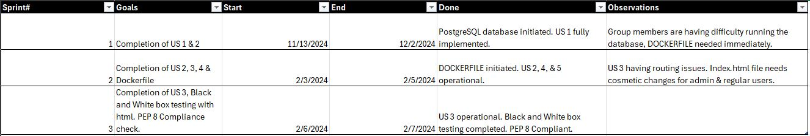

# Overview

## The Vision
Dining out can be a hassle when it comes to finding what you want on the menu, and for restaurant staff, keeping the menu updated can be a time-consuming challenge. Mystic Burgers solves both of these problems. The web app makes it easy for customers to browse, sort, and save their favorite menu items, creating a more enjoyable and personalized dining experience. At the same time, it helps restaurant staff manage and update the menu quickly and efficiently, ensuring that customers always have the freshest options. Mystic Burgers is all about making the dining experience smoother for everyone, from the kitchen to the table.

## Target Audience

**Customers** who want a simple and user-friendly way to explore and interact with the restaurant's menu.

**Restaurant Administrators** who need an easy-to-use tool for managing and updating menu items.


# Design

## User Stories

US#1: Story Points: 3
    The website lists all items curently available by store on the homepage with no log in required
 
US#2: Story Points: 3
    The restaurant has an Admin account able to add new items and delete old items on the menu through the back end.
   
US#3: Story Points: 5
    The restaurant has an Admin account able to update items on the menu through the back end.      
 
US#4:  Story Points: 10
    Restaurant customers should be able to add and remove items from their purchase cart. The purchase screen will total all added items.
 
US#5:  Story Points: 5
    Restaurant customers should be able to browse and sort the menu by categories: appetizers, entrees, desserts, beverages, and sides.
 
US#6 (optional):  Story Points: 13
    Restaurant customers should be able to save their favorite items/ previous orders to order again.


## Sequence Diagram


## Model 


# Development Process 

This section should describe, in general terms, how Scrum was used in this project. Include a table summarizing the division of the project into sprints, the user story goals planned for each sprint, the user stories actually completed, and the start and end dates of each sprint. You may also add any relevant observations about the sprints as you see fit.

|Sprint#|Goals|Start|End|Done|Observations|


# Testing 

Name: Black-box Test     Stmts   Miss  Cover
-------------------------------------------
src/app/__init__.py        29      6    79%
src/app/extensions.py       4      0   100%
src/app/forms.py           53      0   100%
src/app/models.py          42      5    88%
src/app/routes.py         174    133    24%
tests/blackbox.py          59     47    20%
-------------------------------------------
TOTAL                     361    191    47%

Name: White-box Test     Stmts   Miss  Cover
-------------------------------------------
src/app/__init__.py        29      6    79%
src/app/extensions.py       4      0   100%
src/app/forms.py           53      0   100%
src/app/models.py          42      5    88%
src/app/routes.py         174    133    24%
tests/whitebox.py           6      3    50%
-------------------------------------------
TOTAL                     308    147    52%

# Deployment 

The final product must demonstrate the integrity of at least 5 out of the 6 planned user stories. It should be packaged as a Docker image and be deployable using:

```
docker-compose up
```